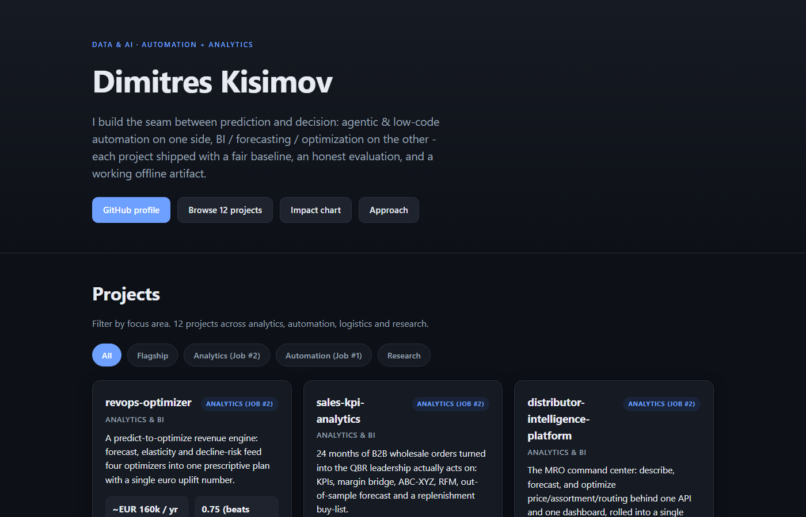

# Data & AI portfolio site

A small, original static site that showcases my Data & AI work — automation & agents on one
side, analytics / BI / optimization on the other, plus some applied-ML research. It is
hand-built and deliberately dependency-free: **no CDN, no web fonts, no icon library, no
JavaScript framework**. Every icon is inline SVG I wrote; the "impact at a glance" chart is
built by hand from the DOM. The page works **fully offline** — double-click `index.html` and it
just runs, no server and no network request.



Live projects, with real (synthetic-data) numbers, are the point. If you want the detail, the
two documents under [`docs/`](docs/) are the substance:

- [`docs/RESULTS_AND_VIZ.md`](docs/RESULTS_AND_VIZ.md) — the master results catalog: for each
  project, what it is, the measured result(s), the visualizations it produces, the use case, and
  honest open improvements.
- [`docs/MARKET_REQUESTS.md`](docs/MARKET_REQUESTS.md) — the most-requested capabilities in BI,
  automation/agentic AI and logistics, with cited public sources, each mapped to the project
  that covers it (or flagged as a backlog gap).

## How it's built

`data/projects.json` is the single source of truth. `build.py` (Python standard library only)
reads it and renders `index.html` from a template string, embedding the project data as inline
JSON so the client-side filtering and the chart work offline. `styles.css` and `app.js` are
hand-written and referenced locally.

```bash
python build.py        # regenerates index.html from data/projects.json
```

Then open `index.html` directly in a browser — no build tools, no server.

To change the site, edit `data/projects.json` (or the template in `build.py`) and re-run
`python build.py`.

## Bilingual (EN + DE, same URL)

The site is fully bilingual on a single URL. Every visible string — UI chrome, project
descriptions, the SVG pipeline diagram, screen-reader strings (`aria-label`s and image `alt`
texts) — ships in English **and** German inside the page as paired `data-en` / `data-de`
attributes; a small client-side toggle in the header swaps the active language in place (no
reload, no redirect, `<html lang>` flips too). Precedence: `?lang=de|en` for a single visit >
the persisted choice in `localStorage` > `navigator.language` (any `de*` locale gets German),
with English as the fallback and as the JS-free default. The German copy keeps the honest
framing — every disclaimer is translated, none softened.

## Site quality gate

Beyond the pytest suite (which guards the generator's inputs), `tools/validate_site.py`
validates the **rendered site as a document**, the way a browser and a screen reader consume
it — standard library only, run locally or in CI:

```bash
python tools/validate_site.py
```

It fails the build on: malformed HTML (unbalanced tags, duplicate ids), broken `#fragment`
links or missing local assets, any external asset reference (the offline guarantee), missing
image alt text or untitled inline SVGs, heading-level skips, any visible string without its
EN/DE pair (proper nouns are explicitly allowlisted), marketing superlatives in either language
(the honest-claims lint), and any text/background color-token pair below the WCAG AA 4.5:1
contrast ratio — computed for both the light and the dark scheme. When introduced, the gate
caught three real contrast defects, which are fixed via the `--on-accent` token and a slightly
darker light-mode accent.

## Project layout

```
portfolio-site/
├── data/projects.json          # single source of truth (projects, metrics, links)
├── build.py                    # stdlib generator: projects.json -> index.html
├── index.html                  # generated site (committed)
├── styles.css                  # hand-written CSS, system fonts, light/dark
├── app.js                      # hand-written JS: filter + hand-built bar chart
├── docs/
│   ├── RESULTS_AND_VIZ.md       # master results & visualization catalog
│   ├── MARKET_REQUESTS.md       # cited market-demand -> project mapping
│   └── BUSINESS_CASE.md         # why this site exists, for whom, evidence of quality
├── tests/
│   ├── test_build.py            # pytest: determinism, coverage, offline guard, escaping, schema
│   └── test_site_validation.py  # pytest: the quality gate passes AND can fail (hostile fixtures)
├── tools/
│   ├── validate_site.py         # site quality gate: HTML, links, a11y, EN/DE DOM, claims, AA contrast
│   └── make_onepager.py         # projects.json -> deliverables/portfolio_onepager.pdf
├── deliverables/               # portfolio_onepager.pdf (generated, committed)
├── pyproject.toml              # ruff + pytest config
├── .github/workflows/ci.yml    # lint + tests + build + offline guard + PDF size check
├── LICENSE  ·  CREDITS.md  ·  .gitignore
```

## Deploy to GitHub Pages

The site is a static file, so Pages needs nothing special:

1. Push this repo to GitHub.
2. In the repo, go to **Settings → Pages**.
3. Under **Build and deployment**, set **Source = Deploy from a branch**, **Branch = `main`**,
   **folder = `/ (root)`**, and save.
4. GitHub serves `index.html` at `https://<user>.github.io/portfolio-site/` within a minute or
   two.

Because everything is local and relative, it works identically on Pages and off a local disk. If
you regenerate the data, run `python build.py` and commit the updated `index.html` before
pushing.

## Honesty

All figures on the site and in the docs are measured on **synthetic, self-generated data** (the
one exception, FlyHash, uses public MNIST and is labelled). They demonstrate method, not results
on any real company's business. Any mention of Würth or Schwarz/Lidl/Kaufland is independent
analysis of public information only — not affiliated with, endorsed by, or using internal data
from those companies. No superlatives, no "state-of-the-art" claims.

— © 2026 Dimitres Kisimov — all rights reserved; published for portfolio review. See LICENSE.
